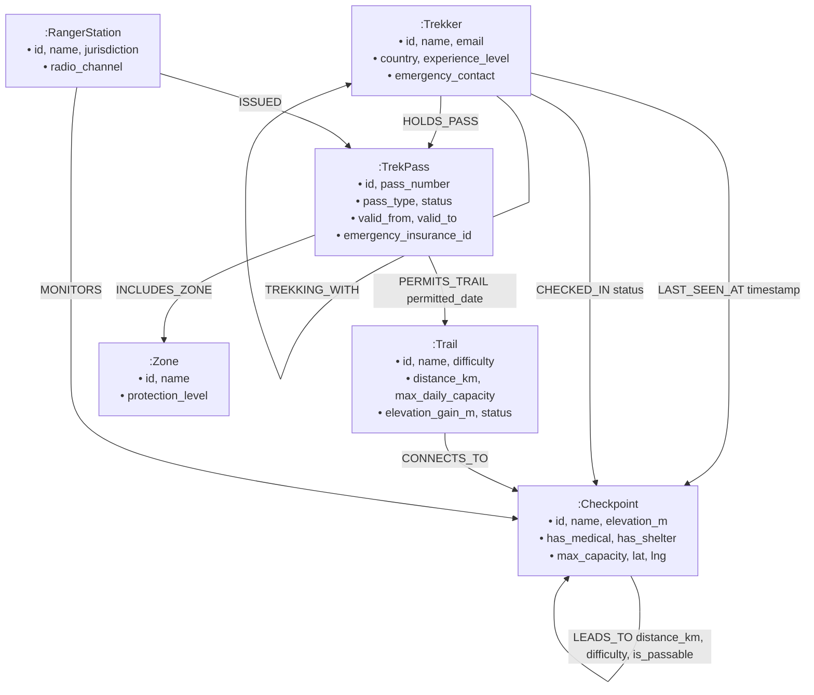

# TrekPass: Mountain Expedition Permit & Trail Safety System

[](https://console.cognodb.com)
[-0284c7?style=flat&logo=fastapi)](https://fastapi.tiangolo.com)
[](https://vitejs.dev)

A comprehensive mountain expedition management system built with high-performance graph topological modeling. **TrekPass** provides high-altitude trekking permit issuance, multi-stage acclimatization pathfinding, real-time emergency medical evacuation routing, companion safety networks, and interactive topology exploration.

---

## 1. Use Case & "Why a Graph Database?"

High-altitude expedition management (e.g. Everest Base Camp, Annapurna Circuit) represents a uniquely interconnected real-world domain. Mountain passes, trails, alpine camps, search-and-rescue clinics, ranger stations, and expedition groups form a dynamic topological network where standard relational SQL tables struggle:

### Why Graph Database over Relational SQL?

1. **Variable-Length Multi-Hop Pathfinding (2+ hops)**:
   - Trails and alpine camps are non-linear graphs. Calculating all valid checkpoint routes from trailhead to high summit with elevation stages is a native 2-line Cypher query: `(c1:Checkpoint)-[:LEADS_TO*1..10]->(c2:Checkpoint)`. In SQL, this requires recursive Common Table Expressions (CTEs), multi-table self-joins, and complex index scans that degrade exponentially with path depth.
2. **Dynamic Emergency Evacuation & Obstacle Avoidance**:
   - In mountain environments, segments frequently become impassable due to avalanches, rockfalls, or altitude sickness. In TrekPass, Cypher dynamically routes around blocked edges (`WHERE ALL(rel IN relationships(p) WHERE rel.is_passable = true)`) to calculate the shortest egress to the nearest medical station.
3. **Multi-Entity Contact Tracing & Ranger Jurisdictions**:
   - Group companions (`:TREKKING_WITH`), permit trails (`:PERMITS_TRAIL`), and last known positions (`:LAST_SEEN_AT`) are instantly reachable across multi-tier dependencies without expensive multi-table foreign key joins.
4. **Trailhead Capacity & Overload Prevention**:
   - Detecting bottlenecks and overlapping permits across interconnected ecological zones is instantaneous via pattern matching.

---

## 2. Graph Data Model & Schema



### Labeled Nodes
- **`Trekker`**: Individual hiker or guide with emergency rescue contacts.
- **`TrekPass`**: Digital permit with validity window, pass tier (`SOLO`, `EXPEDITION`, `LOCAL_GUIDED`), and status (`ACTIVE`, `EXPIRED`, `REVOKED`).
- **`Trail`**: Major expedition route with ecological capacity limits.
- **`Checkpoint`**: Mountain waypoints and high-altitude emergency clinics.
- **`RangerStation`**: Sector headquarters monitoring safety and radio frequencies.
- **`Zone`**: Protected conservation areas.

---

## 3. Main Cypher Queries Explained

All queries use the official `neo4j` Python driver and are strictly parameterized with `$param` bindings.

### Query 1: Multi-Hop Trail Route Discovery (2+ Hops)
```cypher
MATCH p = (start:Checkpoint {id: $start_id})-[:LEADS_TO*1..10]->(end:Checkpoint {id: $end_id})
WHERE ALL(rel IN relationships(p) WHERE rel.is_passable = true)
RETURN [n IN nodes(p) | {
           id: n.id,
           name: n.name,
           elevation_m: n.elevation_m,
           has_medical: n.has_medical,
           has_shelter: n.has_shelter
       }] AS path_checkpoints,
       [r IN relationships(p) | {
           distance_km: r.distance_km,
           difficulty: r.difficulty,
           trail_name: r.trail_name
       }] AS segments,
       reduce(total_km = 0.0, r IN relationships(p) | total_km + r.distance_km) AS total_distance_km,
       length(p) AS hop_count
ORDER BY total_distance_km ASC
LIMIT 5;
```

### Query 2: Emergency Evacuation Route
```cypher
MATCH p = (start:Checkpoint {id: $current_checkpoint_id})-[:LEADS_TO*1..10]->(safe:Checkpoint {has_medical: true})
WHERE ALL(rel IN relationships(p) WHERE rel.is_passable = true)
RETURN [n IN nodes(p) | {
           id: n.id,
           name: n.name,
           elevation_m: n.elevation_m,
           has_medical: n.has_medical
       }] AS evac_route,
       reduce(total_km = 0.0, r IN relationships(p) | total_km + r.distance_km) AS total_evac_distance_km,
       safe.name AS destination_hospital,
       length(p) AS hops_to_safety
ORDER BY total_evac_distance_km ASC
LIMIT 3;
```

---

## 4. Setup & Run Instructions

### Step 1: Configure Credentials
Edit `backend/.env`:
```env
COGNODB_URI=bolt+s://your-instance-id.databases.cognodb.com:7687
COGNODB_USER=cognodb
COGNODB_PASSWORD=your_password
PORT=8000
```

### Step 2: Seed Database
```bash
cd backend
python seed.py
```

### Step 3: Start Backend API
```bash
python -m uvicorn app.main:app --reload --port 8000
```

### Step 4: Start Frontend UI
```bash
cd ../frontend
npm run dev
```
Open **`http://localhost:5173`** in your browser.
