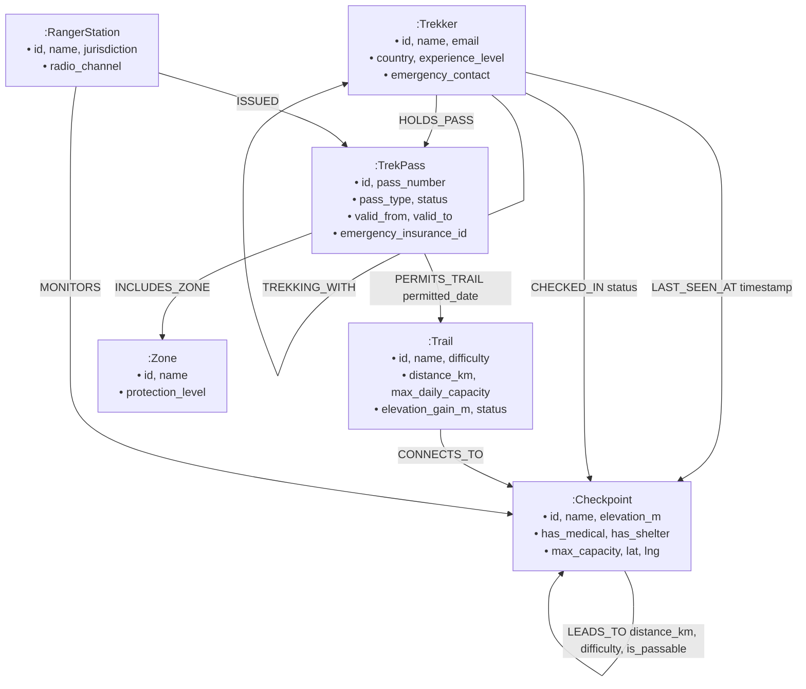

# TrekPass: Mountain Expedition Permit & Trail Safety System

[](https://trekpass.onrender.com)
[](https://github.com/pranavsrinathkashyap/trekpass)
[-0284c7?style=for-the-badge&logo=neo4j)](https://console.cognodb.com)
[-0d9488?style=for-the-badge&logo=fastapi)](https://fastapi.tiangolo.com)
[](https://vitejs.dev)

A comprehensive mountain expedition management system built with high-performance graph topological modeling on **CognoDB Cloud**. **TrekPass** provides high-altitude trekking permit issuance, duplicate booking validation, multi-stage acclimatization pathfinding, real-time emergency medical evacuation routing, companion safety reachability networks, and an interactive topology visualizer.

---

## 🔗 Live Application & Repository Details

- **Hosted Application Demo**: [https://trekpass.onrender.com](https://trekpass.onrender.com) *(Free tier on Render)*
- **GitHub Repository**: [https://github.com/pranavsrinathkashyap/trekpass](https://github.com/pranavsrinathkashyap/trekpass)
- **Database Backend**: CognoDB Cloud Instance (`db-9e69410e.bravo.databases.cognodb.com:7687`) over encrypted Bolt protocol.

---

## 1. Use Case & "Why a Graph Database?"

High-altitude expedition management (e.g., Everest Base Camp, Annapurna Circuit) represents a uniquely interconnected domain. Mountain passes, trails, alpine camps, search-and-rescue clinics, ranger stations, and expedition groups form a dynamic topological network where standard relational SQL tables struggle:

### Why Graph Database over Relational SQL?

1. **Variable-Length Multi-Hop Pathfinding (2+ hops)**:
   - Mountain trails and high-alpine camps are non-linear graphs. Calculating all valid checkpoint routes from trailhead to high summit with elevation stages is a native Cypher query: `(c1:Checkpoint)-[:LEADS_TO*1..10]->(c2:Checkpoint)`. In SQL, this requires recursive Common Table Expressions (CTEs), multi-table self-joins, and complex index scans that degrade exponentially with path depth.
2. **Dynamic Emergency Evacuation & Obstacle Avoidance**:
   - In mountain environments, segments frequently become impassable due to avalanches, rockfalls, or altitude sickness. In TrekPass, Cypher dynamically routes around blocked edges (`WHERE ALL(rel IN relationships(p) WHERE rel.is_passable = true)`) to calculate the shortest egress to the nearest high-altitude medical station.
3. **Multi-Entity Contact Tracing & Ranger Jurisdictions**:
   - Group companions (`:TREKKING_WITH`), permit trails (`:PERMITS_TRAIL`), and last known positions (`:LAST_SEEN_AT`) are instantly reachable across multi-tier dependencies without expensive multi-table foreign key joins.
4. **Trailhead Capacity & Overload Prevention**:
   - Detecting bottlenecks and overlapping permits across interconnected ecological zones is instantaneous via graph pattern matching.

---

## 2. Graph Data Model & Schema



### Labeled Nodes
- **`Trekker`**: Individual hiker or guide with nationality and emergency rescue contact.
- **`TrekPass`**: Digital permit with validity dates, tier (`SOLO`, `EXPEDITION`, `LOCAL_GUIDED`), and status (`ACTIVE`, `EXPIRED`, `REVOKED`).
- **`Trail`**: Major expedition route with ecological capacity limits.
- **`Checkpoint`**: Mountain waypoints and high-altitude emergency clinics.
- **`RangerStation`**: Sector headquarters monitoring safety and VHF radio frequencies.
- **`Zone`**: Protected conservation areas.

### Typed Relationships
- `(:Trekker)-[:HOLDS_PASS]->(:TrekPass)`
- `(:TrekPass)-[:PERMITS_TRAIL {permitted_date}]->(:Trail)`
- `(:TrekPass)-[:INCLUDES_ZONE]->(:Zone)`
- `(:Trail)-[:CONNECTS_TO]->(:Checkpoint)`
- `(:Checkpoint)-[:LEADS_TO {distance_km, difficulty, is_passable, trail_name}]->(:Checkpoint)`
- `(:Trekker)-[:TREKKING_WITH]->(:Trekker)` *(Expedition groups)*
- `(:Trekker)-[:LAST_SEEN_AT {timestamp}]->(:Checkpoint)` *(Search & Rescue)*
- `(:RangerStation)-[:MONITORS]->(:Checkpoint)`
- `(:RangerStation)-[:ISSUED]->(:TrekPass)`

---

## 3. Core Application Features

### 1. 🏔️ Himalayan Explore Landing Page
- Atmospheric mountaineering photography hero with bold typography and Sagarmatha authority branding.
- Quick altitude statistics: **8,848m Summit**, **5,364m Base Camp**, and **6 High-Altitude Rescue Clinics**.
- Featured trail showcases with distance, climbing profile, duration, and difficulty.

### 2. 📊 Mountain Elevation & Acclimatization Profile
- Interactive visual gradient chart tracking the 8 elevation stages from *Lukla Gateway (2,860m)* through *Everest Base Camp (5,364m)*.
- Visual markers for high-altitude emergency medical clinics and shelters with property inspector drawer.

### 3. 🎫 Digital Trekking Permit Issuance & Confirmation Card
- Modal to issue official permits connecting Trekker, Permitted Route, and Issuing Ranger Post.
- **Instant Digital Confirmation Card**: Displays official permit number, holder details, route, validity dates, database reference ID, and QR verification simulation.
- **Duplicate & Overlap Date Prevention**: Graph query prevents a trekker from booking multiple permits covering the same or overlapping dates.

### 4. 🚫 Revoke & Reactivate Lifecycle Management
- **Revoke Permit**: Single-click action to revoke permits and automatically transition them to the dedicated **Revoked (🔴)** list.
- **Reactivate Option**: Single-click reactivation to restore revoked permits back to Active status.
- Tabbed filters: **All**, **Active**, **Revoked**, and **Expired**.

### 5. ⚠️ Real-Time Hazard & Obstacle Simulator
- 1-click mountain hazard simulation toggling rockfalls or avalanches on trail segments (`is_passable = false`).
- Instantly forces emergency evacuation algorithms to calculate alternate detour routes.

### 6. 🚑 Multi-Hop Route Pathfinder & Emergency Medical Egress
- **Route Navigator (2+ Hops)**: Discovers multi-stage waypoint traversals with cumulative distance and elevation changes.
- **Emergency Evacuation Egress**: Automatically routes distressed hikers from any waypoint to the nearest equipped medical clinic avoiding blocked segments.

### 7. 👥 Trekker Registry & Companion Safety Network
- Register new trekkers with emergency rescue contacts directly into CognoDB Cloud.
- **Companion Reachability Network**: Multi-degree graph traversal discovering linked group members and assigned ranger station radio frequencies.
- Log real-time waypoint check-ins.

### 8. 🌐 Interactive Topology Visualizer
- Force-directed canvas visualizer rendering all nodes and relationships with pan, zoom, drag physics, and property inspection.

---

## 4. Main Cypher Queries Explained

All queries use the official `neo4j` Python driver and are strictly parameterized with `$param` bindings (no string concatenation).

### Query 1: Multi-Hop Trail Route Discovery (2+ Hops)
```cypher
MATCH p = (start:Checkpoint {id: $start_id})-[:LEADS_TO*1..10]->(end:Checkpoint {id: $end_id})
WHERE ALL(rel IN relationships(p) WHERE rel.is_passable = true)
RETURN [n IN nodes(p) | {
           id: n.id,
           name: n.name,
           elevation_m: n.elevation_m,
           has_medical: n.has_medical,
           has_shelter: n.has_shelter
       }] AS path_checkpoints,
       [r IN relationships(p) | {
           distance_km: r.distance_km,
           difficulty: r.difficulty,
           trail_name: r.trail_name
       }] AS segments,
       reduce(total_km = 0.0, r IN relationships(p) | total_km + r.distance_km) AS total_distance_km,
       length(p) AS hop_count
ORDER BY total_distance_km ASC
LIMIT 5;
```

### Query 2: Emergency Evacuation Route (Awkward for SQL)
```cypher
MATCH p = (start:Checkpoint {id: $current_checkpoint_id})-[:LEADS_TO*1..10]->(safe:Checkpoint {has_medical: true})
WHERE ALL(rel IN relationships(p) WHERE rel.is_passable = true)
RETURN [n IN nodes(p) | {
           id: n.id,
           name: n.name,
           elevation_m: n.elevation_m,
           has_medical: n.has_medical,
           has_shelter: n.has_shelter
       }] AS evac_route,
       reduce(total_km = 0.0, r IN relationships(p) | total_km + r.distance_km) AS total_evac_distance_km,
       safe.name AS destination_hospital,
       length(p) AS hops_to_safety
ORDER BY total_evac_distance_km ASC
LIMIT 3;
```

### Query 3: Duplicate Date Overlap Prevention
```cypher
MATCH (t:Trekker {id: $trekker_id})-[:HOLDS_PASS]->(p:TrekPass {status: 'ACTIVE'})
WHERE p.valid_from <= $req_to AND p.valid_to >= $req_from
RETURN p.id AS id, p.pass_number AS pass_number, p.valid_from AS valid_from, p.valid_to AS valid_to, t.name AS trekker_name
LIMIT 1;
```

### Query 4: Multi-Degree Companion Reachability & Ranger Frequencies
```cypher
MATCH (t:Trekker {id: $trekker_id})
OPTIONAL MATCH (t)-[:TREKKING_WITH*1..2]-(companion:Trekker)
OPTIONAL MATCH (t)-[:LAST_SEEN_AT]->(last_loc:Checkpoint)
OPTIONAL MATCH (t)-[:HOLDS_PASS]->(p:TrekPass)-[:PERMITS_TRAIL]->(tr:Trail)-[:CONNECTS_TO]->(cp:Checkpoint)<-[:MONITORS]-(r:RangerStation)
RETURN t.id AS id,
       t.name AS name,
       t.email AS email,
       t.emergency_contact AS emergency_contact,
       t.experience_level AS experience_level,
       last_loc.name AS last_known_location,
       collect(DISTINCT {
           id: companion.id,
           name: companion.name,
           email: companion.email,
           emergency_contact: companion.emergency_contact
       }) AS expedition_companions,
       collect(DISTINCT {
           id: r.id,
           name: r.name,
           radio_channel: r.radio_channel,
           jurisdiction: r.jurisdiction
       }) AS alert_ranger_stations;
```

---

## 5. Local Setup & Run Commands

### Prerequisites
- Python 3.10+
- Node.js 18+

### Step 1: Clone Repository
```bash
git clone https://github.com/pranavsrinathkashyap/trekpass.git
cd trekpass
```

### Step 2: Configure Environment Variables
Create `backend/.env` (or copy from `.env.example`):
```env
COGNODB_URI=bolt+s://db-9e69410e.bravo.databases.cognodb.com:7687
COGNODB_USER=cognodb
COGNODB_PASSWORD=b14fdc235b8c560742a571c5c62fa69d
PORT=8000
```

### Step 3: Run Backend API
```bash
cd backend
pip install -r requirements.txt
python seed.py               # (Optional: seeds/synchronizes database)
python -m uvicorn app.main:app --reload --port 8000
```

### Step 4: Run Frontend Development Server
```bash
cd ../frontend
npm install
npm run dev
```
Open **`http://localhost:5173`** in your browser.

---

## 6. Project Structure

```
trekpass/
├── backend/
│   ├── app/
│   │   ├── config.py           # Environment variables configuration
│   │   ├── db.py               # Neo4j/CognoDB driver lifecycle & health checks
│   │   ├── queries.py          # Parameterized Cypher queries repository
│   │   ├── mock_data.py        # In-memory fallback graph store
│   │   ├── routes/
│   │   │   ├── passes.py       # Pass creation, duplicate check, status & delete
│   │   │   ├── trails.py       # Pathfinding, evacuation & hazard toggling
│   │   │   ├── trekkers.py     # Trekker registration, check-ins & companion network
│   │   │   ├── stats.py        # Capacity & dashboard metrics
│   │   │   └── graph.py        # Node-edge visualizer export
│   │   └── main.py             # FastAPI entrypoint & unified static file serving
│   ├── seed.py                 # Himalayan graph dataset seeder
│   ├── requirements.txt        # Python dependencies
│   └── .env.example            # Environment template
├── frontend/
│   ├── src/
│   │   ├── components/
│   │   │   ├── Navbar.jsx          # Top navigation & system status
│   │   │   ├── PassCardModal.jsx   # Digital permit card & QR viewer
│   │   │   ├── PassModal.jsx       # Issue new permit & confirmation modal
│   │   │   ├── AddTrekkerModal.jsx # Register new trekker modal
│   │   │   ├── CheckinModal.jsx    # Checkpoint check-in modal
│   │   │   └── GraphCanvas.jsx     # Interactive force-directed canvas
│   │   ├── pages/
│   │   │   ├── LandingPage.jsx     # Explore landing page with photography
│   │   │   ├── Dashboard.jsx       # Altitude visualizer & capacity gauges
│   │   │   ├── PassesPage.jsx      # Permit list, Revoke action & status tabs
│   │   │   ├── TrailsPage.jsx      # Trail directory & hazard simulator
│   │   │   ├── RouteFinderPage.jsx # Multi-hop pathfinder & emergency evac
│   │   │   ├── TrekkersPage.jsx    # Trekker tracking & companion graph
│   │   │   └── GraphPage.jsx       # Interactive graph visualizer & inspector
│   │   ├── services/
│   │   │   └── api.js              # Axios API service
│   │   ├── App.jsx                 # Root layout & routing
│   │   └── index.css               # Alpine styling
│   ├── package.json
│   └── vite.config.js
├── render.yaml                 # 1-Click Render Cloud deployment blueprint
└── README.md
```
