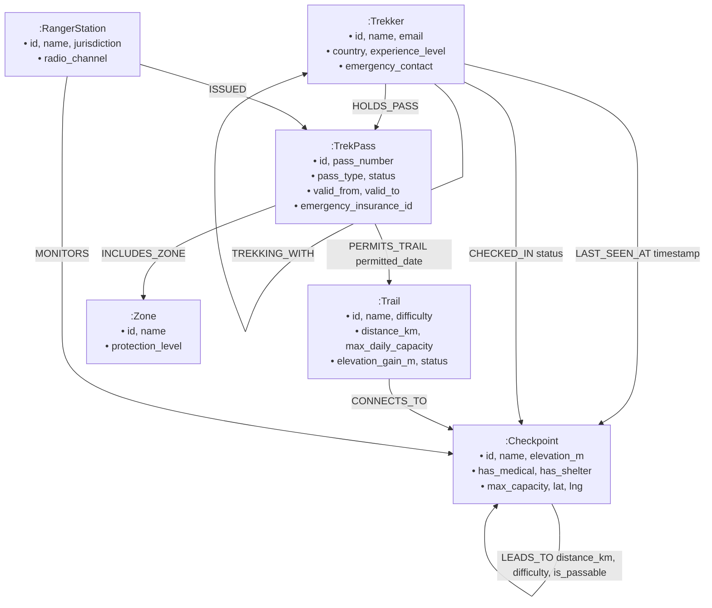

# TrekPass: Mountain Expedition Permit & Trail Safety System

[-059669?style=flat&logo=neo4j)](https://console.cognodb.com)
[-0284c7?style=flat&logo=fastapi)](https://fastapi.tiangolo.com)
[](https://vitejs.dev)

A full-stack mountain expedition permit and trail safety system built with graph topological data modeling on **CognoDB Cloud**. **TrekPass** provides high-altitude trekking permit management, multi-stage acclimatization navigation, real-time emergency medical evacuation routing, companion group networks, and an interactive topology visualizer.

---

## 1. Use Case & "Why a Graph Database?"

High-altitude expedition management (e.g., Everest Base Camp, Annapurna Circuit) represents a uniquely interconnected real-world domain. Mountain passes, trails, alpine camps, search-and-rescue clinics, ranger stations, and expedition groups form a dynamic topological network where standard relational SQL tables struggle:

### Why Graph Database over Relational SQL?

1. **Variable-Length Multi-Hop Pathfinding (2+ hops)**:
   - Trails and alpine camps are non-linear graphs. Calculating all valid checkpoint routes from trailhead to high summit with elevation stages is a native Cypher query: `(c1:Checkpoint)-[:LEADS_TO*1..10]->(c2:Checkpoint)`. In SQL, this requires recursive Common Table Expressions (CTEs), multi-table self-joins, and complex index scans that degrade exponentially with path depth.
2. **Dynamic Emergency Evacuation & Obstacle Avoidance**:
   - In mountain environments, segments frequently become impassable due to avalanches, rockfalls, or altitude sickness. In TrekPass, Cypher dynamically routes around blocked edges (`WHERE ALL(rel IN relationships(p) WHERE rel.is_passable = true)`) to calculate the shortest egress to the nearest high-altitude medical station.
3. **Multi-Entity Group Contacts & Ranger Jurisdictions**:
   - Group companions (`:TREKKING_WITH`), permit trails (`:PERMITS_TRAIL`), and last known positions (`:LAST_SEEN_AT`) are instantly reachable across multi-tier dependencies without expensive multi-table foreign key joins.
4. **Trailhead Capacity & Overload Prevention**:
   - Detecting bottlenecks and overlapping permits across interconnected ecological zones is instantaneous via graph pattern matching.

---

## 2. Graph Data Model & Schema



### Labeled Nodes
- **`Trekker`**: Individual hiker or guide with nationality and emergency rescue contact.
- **`TrekPass`**: Digital permit with validity dates, tier (`SOLO`, `EXPEDITION`, `LOCAL_GUIDED`), and status (`ACTIVE`, `EXPIRED`, `REVOKED`).
- **`Trail`**: Major expedition route with ecological capacity limits.
- **`Checkpoint`**: Mountain waypoints and high-altitude emergency clinics.
- **`RangerStation`**: Sector headquarters monitoring safety and VHF radio frequencies.
- **`Zone`**: Protected conservation areas.

### Typed Relationships
- `(:Trekker)-[:HOLDS_PASS]->(:TrekPass)`
- `(:TrekPass)-[:PERMITS_TRAIL {permitted_date}]->(:Trail)`
- `(:TrekPass)-[:INCLUDES_ZONE]->(:Zone)`
- `(:Trail)-[:CONNECTS_TO]->(:Checkpoint)`
- `(:Checkpoint)-[:LEADS_TO {distance_km, difficulty, is_passable, trail_name}]->(:Checkpoint)`
- `(:Trekker)-[:TREKKING_WITH]->(:Trekker)` *(Expedition groups)*
- `(:Trekker)-[:LAST_SEEN_AT {timestamp}]->(:Checkpoint)` *(Search & Rescue)*
- `(:RangerStation)-[:MONITORS]->(:Checkpoint)`
- `(:RangerStation)-[:ISSUED]->(:TrekPass)`

---

## 3. Main Cypher Queries Explained

All queries use the official `neo4j` Python driver and are strictly parameterized with `$param` bindings (no string concatenation).

### Query 1: Multi-Hop Trail Route Discovery (2+ Hops)
Calculates optimal checkpoint sequence, cumulative distance, and elevation profile:
```cypher
MATCH p = (start:Checkpoint {id: $start_id})-[:LEADS_TO*1..10]->(end:Checkpoint {id: $end_id})
WHERE ALL(rel IN relationships(p) WHERE rel.is_passable = true)
RETURN [n IN nodes(p) | {
           id: n.id,
           name: n.name,
           elevation_m: n.elevation_m,
           has_medical: n.has_medical,
           has_shelter: n.has_shelter
       }] AS path_checkpoints,
       [r IN relationships(p) | {
           distance_km: r.distance_km,
           difficulty: r.difficulty,
           trail_name: r.trail_name
       }] AS segments,
       reduce(total_km = 0.0, r IN relationships(p) | total_km + r.distance_km) AS total_distance_km,
       length(p) AS hop_count
ORDER BY total_distance_km ASC
LIMIT 5;
```

### Query 2: Emergency Evacuation Route (Awkward for SQL)
Computes shortest safe egress to the nearest high-altitude medical station from any distress waypoint:
```cypher
MATCH p = (start:Checkpoint {id: $current_checkpoint_id})-[:LEADS_TO*1..10]->(safe:Checkpoint {has_medical: true})
WHERE ALL(rel IN relationships(p) WHERE rel.is_passable = true)
RETURN [n IN nodes(p) | {
           id: n.id,
           name: n.name,
           elevation_m: n.elevation_m,
           has_medical: n.has_medical
       }] AS evac_route,
       reduce(total_km = 0.0, r IN relationships(p) | total_km + r.distance_km) AS total_evac_distance_km,
       safe.name AS destination_hospital,
       length(p) AS hops_to_safety
ORDER BY total_evac_distance_km ASC
LIMIT 3;
```

### Query 3: Multi-Degree Companion Reachability & Contact Tracing
Traverses expedition group networks and discovers responsible monitoring ranger stations:
```cypher
MATCH (t:Trekker {id: $trekker_id})
OPTIONAL MATCH (t)-[:TREKKING_WITH*1..2]-(companion:Trekker)
OPTIONAL MATCH (t)-[:LAST_SEEN_AT]->(last_loc:Checkpoint)
OPTIONAL MATCH (t)-[:HOLDS_PASS]->(p:TrekPass)-[:PERMITS_TRAIL]->(tr:Trail)-[:CONNECTS_TO]->(cp:Checkpoint)<-[:MONITORS]-(r:RangerStation)
RETURN t.id AS id,
       t.name AS name,
       last_loc.name AS last_known_location,
       collect(DISTINCT companion.name) AS expedition_companions,
       collect(DISTINCT r.name) AS alert_ranger_stations;
```

### Query 4: Real-Time Trailhead Capacity & Occupancy
Aggregates active passes against environmental maximums:
```cypher
MATCH (tr:Trail)
OPTIONAL MATCH (p:TrekPass {status: 'ACTIVE'})-[:PERMITS_TRAIL]->(tr)
OPTIONAL MATCH (t:Trekker)-[:HOLDS_PASS]->(p)
RETURN tr.id AS trail_id,
       tr.name AS trail_name,
       tr.max_daily_capacity AS max_daily_capacity,
       count(DISTINCT t) AS active_trekkers,
       round((toFloat(count(DISTINCT t)) / tr.max_daily_capacity) * 100, 1) AS capacity_utilization_pct
ORDER BY capacity_utilization_pct DESC;
```

---

## 4. Key Application Features

- **🏔️ High-End Explore Landing Page**: Atmospheric Himalayan mountaineering hero with photography, altitude ribbons (8,848m Summit, 5,364m EBC), and featured trail cards.
- **📊 Interactive Altitude Gradient Visualizer**: Checkpoint elevation chart tracking the 8 stages from Lukla (2,860m) to Everest Base Camp (5,364m) with clinic flags and shelter status.
- **🎫 Digital Trekking Permits**: Instant pass issuance with QR code verification badge, permit tiers, and emergency rescue credentials.
- **⚠️ Live Hazard & Landslide Simulator**: 1-click obstacle simulation to test dynamic graph rerouting around blocked trail segments.
- **👥 Trekker Registration & Check-In**: Full registration form saving hikers to CognoDB and logging real-time checkpoint positions.
- **🌐 Interactive Topology Explorer**: Custom canvas force-directed graph visualizer with pan/zoom, physics simulation, node type color coding, and property inspector.

---

## 5. Setup & Run Instructions

### Step 1: Configure Credentials
Create `backend/.env` from `.env.example`:
```env
COGNODB_URI=bolt+s://your-instance-id.databases.cognodb.com:7687
COGNODB_USER=cognodb
COGNODB_PASSWORD=your_generated_password
PORT=8000
```

### Step 2: Seed Database
```bash
cd backend
python seed.py
```

### Step 3: Start Backend API
```bash
python -m uvicorn app.main:app --reload --port 8000
```

### Step 4: Start Frontend UI
```bash
cd ../frontend
npm run dev
```
Open **`http://localhost:5173`** in your browser.

---

## 6. Project Structure

```
trekpass/
├── backend/
│   ├── app/
│   │   ├── config.py           # Environment variables configuration
│   │   ├── db.py               # Neo4j/CognoDB driver lifecycle & health checks
│   │   ├── queries.py          # Parameterized Cypher queries repository
│   │   ├── mock_data.py        # In-memory fallback graph store
│   │   ├── routes/
│   │   │   ├── passes.py       # Pass creation & status endpoints
│   │   │   ├── trails.py       # Pathfinding, evacuation & hazard toggling
│   │   │   ├── trekkers.py     # Trekker registration, check-ins & companion network
│   │   │   ├── stats.py        # Capacity & dashboard metrics
│   │   │   └── graph.py        # Node-edge visualizer export
│   │   └── main.py             # FastAPI entrypoint & unified static file serving
│   ├── seed.py                 # Himalayan graph dataset seeder
│   ├── requirements.txt        # Python dependencies
│   └── .env.example            # Environment template
├── frontend/
│   ├── src/
│   │   ├── components/
│   │   │   ├── Navbar.jsx          # Top navigation & system status
│   │   │   ├── PassCardModal.jsx   # Digital permit card & QR viewer
│   │   │   ├── PassModal.jsx       # Issue new permit modal
│   │   │   ├── AddTrekkerModal.jsx # Register new trekker modal
│   │   │   ├── CheckinModal.jsx    # Checkpoint check-in modal
│   │   │   └── GraphCanvas.jsx     # Interactive force-directed canvas
│   │   ├── pages/
│   │   │   ├── LandingPage.jsx     # Explore landing page with photography
│   │   │   ├── Dashboard.jsx       # Altitude visualizer & capacity gauges
│   │   │   ├── PassesPage.jsx      # Permit list & status management
│   │   │   ├── TrailsPage.jsx      # Trail directory & hazard simulator
│   │   │   ├── RouteFinderPage.jsx # Multi-hop pathfinder & emergency evac
│   │   │   ├── TrekkersPage.jsx    # Trekker tracking & companion graph
│   │   │   └── GraphPage.jsx       # Interactive graph visualizer & inspector
│   │   ├── services/
│   │   │   └── api.js              # Axios API service
│   │   ├── App.jsx                 # Root layout & routing
│   │   └── index.css               # Alpine styling
│   ├── package.json
│   └── vite.config.js
├── render.yaml                 # 1-Click Render Cloud deployment blueprint
└── README.md
```
